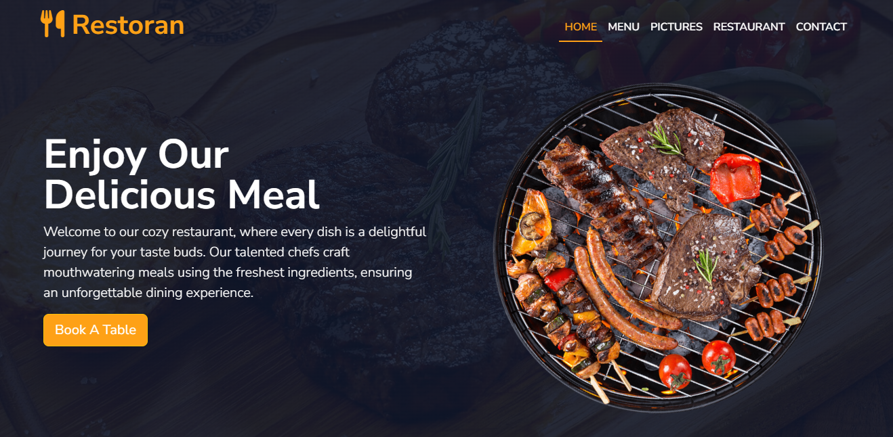
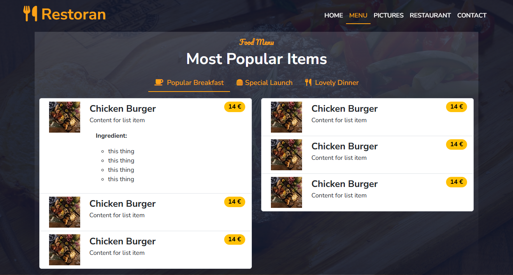
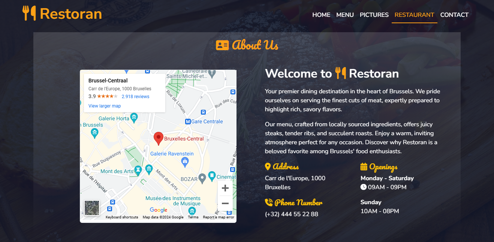

# Restaurant-CSS-Framework

This is an exercise project for creating a restaurant website assigned by my coach during the junior frontend developer training at [**BeCode**](https://becode.org). The goal of this project is to develop a responsive website using the CSS framework [**Bootstrap**](https://getbootstrap.com/).

## The Mission 📃

Create a repository called restaurant-css-framework in which you must realise a window web page for a restaurant. The franchise is fictive, but the type of food (burger, pizza, asian, …​) is your choice.

- The website must be responsive, at least for small and medium screens. It must at least have five accessible pages: welcome, menu, pictures, restaurants and contact.

- Welcome
  A page with one Jumbotron and two panels to show news (promo, events, etc…​).

- Menu
  A page with the restaurant menu in the form of a grouped list with badges.

- Pictures
  A page with a gallery of minimum 10 pictures and a pagination (3 photos per page).

- Restaurant
  A page about the restaurants (it’s a franchise) with its addresses, a map, and different schedules.

- Contact
  A page with a contact form containing the firstname, lastname, email, subject of the message (a drop-down list with multiple options), an area for the message itself and a send button with an icon. Each entry as a title in a semantically correct tag.

# Site

You can visit site here: [Live Link](https://alisepar.github.io/restaurant-css-framework/index.html)

# Screenshot

| Pages   | Screenshots                                                                                        |
| ------- | -------------------------------------------------------------------------------------------------- |
| Index   |      |
| Menu    |        |
| About   |      |
| Contact |  |

# Technology

- HTML/Css structure and style
- Bootstrap for Style
- [animate.style](https://animate.style/) for animation
- [Font Awesome](https://fontawesome.com/) for Icons
- [shortpixel.com](https://shortpixel.com/online-image-compression) for changing image type and size
- [Google Map](https://www.google.com/maps/) for show the location

## Author

**[Alisabah Separ](https://github.com/AliSepar)**
